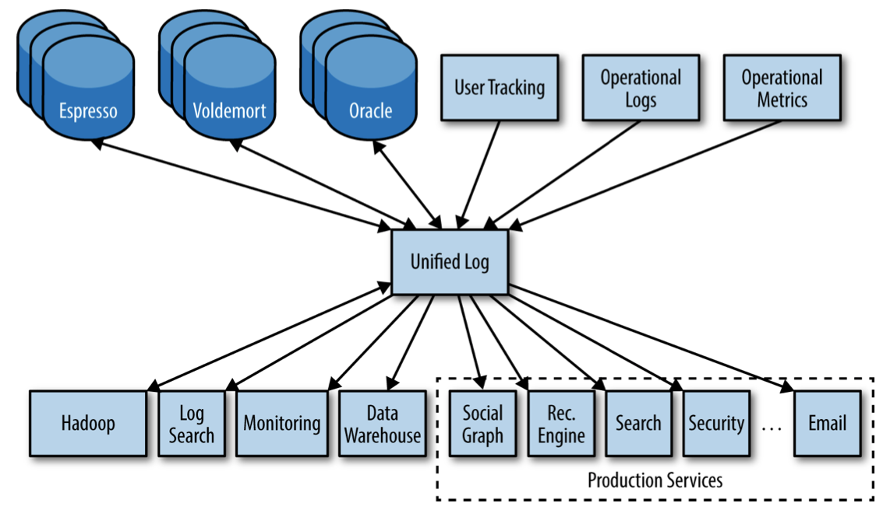
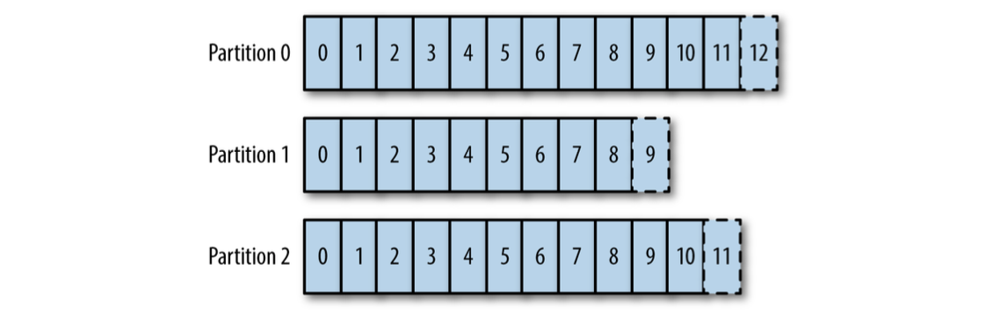

## Logs in Distributed Systems

>This notebook serves as an introduction to how logs work in distributed systems. We then will provide practical applications of these concepts to a variety of common uses: data integration, enterprise architecture, real-time data processing, and data system design.

* * *

#### Log


                                                                                                         
                                                                                                           
- Log is a series of loosely structured requests, errors, or other messages in a sequence of rotating text files
- Humans do not read logs, it's not manageable when services and servers are involved
  - The purpose of logs is an input to queries and graphs to understand behavior across many machines
- The log we are discussing - also known as - `commit log` or `journal` is an **append-only** sequence of records ordered by time


- Each rectangle represents a record that was appended to the log
- Records are stored in the order they were appended
- Reads proceed from left to right
- Each entry appended to the log is assigned a unique, sequential log entry number that acts as its unique key
- The ordering of records defines a notion of “time” 
  - Entries to the left are defined to be older then entries to the right
  - The log entry number can be thought of as the “timestamp” of the entry

A file is an array of bytes, a table is an array of records, and a log is really just a kind of table or file where the records are sorted by time

- Logs look like a file or a table. (array of bytes, array of records). However, it is important that we think about the log as an abstract data structure, not a text file

**Key takeaway: Logs record what happened and when!**

* * *

#### Logs in Databases

- Logs usage in databases: keeping in sync a variety of data structures and indexes in the presence of crashes
  - Logs write out information about the database records it will be modifying before applying the changes to all the various data structures that it maintains
  - The log is the record of what happened, and each table or index is a pro‐ jection of this history into some useful data structure or index
  - It is used as the authoritative source in restoring all other persistent structures in the event of a crash
  - Log is a method for replicating data between databases - (the sequence of changes that hap‐ pened on the database is exactly what is needed to keep a remote replica database in sync)
    - Oracle, MySQL, PostgreSQL, and MongoDB include log shipping protocols (replica databases that act as slaves)
    - The slaves can then apply the changes recorded in the log to their own local data structures to stay in sync with the master

**Other use-cases of log:**

1.) Publish/subscribe mechanism to transmit data to other replicas

2.) Consistency mechanism to order the updates that are applied to multiple replicas

* * * 

#### Logs in Distributed Systems 

>If two identical, **deterministic** processes begin in the same **state** and get the same inputs in the same order, they will produce the same output and end in the same state.

- **Deterministic:** means that the processing isn’t timing dependent and doesn’t let any other out-of-band input influence its results
- **State:** of the process is whatever data remains on the machine, either in memory or on disk, after our processing

Two deterministic pieces of code => the same input log => the same output => in the same order

**Application in distributed systems:**
- Squeeze all the nondeterminism out of the input stream to ensure that each replica that is processing this input stays in sync

- You can describe the state of each replica by a single number: the `timestamp` for the maximum log entry that it has processed
  - Two replicas at the same time will be in the same state
    - This timestamp combined with the log uniquely capture the entire state of the replica
    - This gives a discrete, event-driven notion of time that, unlike the machine’s local clocks, is easily compara‐ ble between different machines

* * *

#### Log-Centric Designs

- **Physical** (or row-based logging) means logging the contents of each row that is changed
- **Logical** (or statement logging) means not logging the changed rows, but instead logging the SQL commands that lead to the row changes (the insert, update, and delete statements)
- (1) **State Machine Model** is an active-active model, where we keep a log of the incoming requests and each replica processes each request in log order
  - (2) Slightly modified **Primary-Backup Model** elects one replica as the leader. This leader processes requests in the order they arrive and logs the changes to its state that occur as a result of processing the requests. Other replicas apply the state changes that the leader makes so that they will be in sync and ready to take over as leader, should the leader fail.
  
Figure explanation:
  **Primary Backup Model**: The `Master` node handles all reads and writes. Each write is posted to The Log. `Slaves` are subscribed to this log and they apply the changes that the master executed. So if the `Master` fails - a new Master is elected from the `Slaves`

**State Machine Replication Model:** All nodes are peers. Writes first go to The Log and all nodes apply the write in the order determined by The Log.
  
  

* * * 

#### Example

Say we want to implement a replicated arithmetic service that maintains a set of variables (initialized to zero) and applies additions, multiplications, subtrac‐ tions, divisions, and queries on these values.

Commands:
```
x? // get the current value of x x+=5 // add 5 to x
x-=2 // subtract 2 from x
y*=2 // double y
```

In case of a single server variables can be stored in memory/disk and can be updated in whatever order it receives requests. But single server == lack of fault tolerance => we cannot scale the serving. 

**How do we solve this problem?**

- We can add more servers** that replicate this state and the processing logic. 
  - *Problem with this? Servers might get out of sync e.g a failed server misses updates.*
- Push the queries and updates into a remote database.
  - *Problem with this? This moves the problem out of our application, but doesn’t really solve fault tolerance in the database*

**Solution == Log**

- The **State-Machine Replication** approach would involve first writing to the log the operation that is to be performed, then having each replica apply the operations in the log order. In this case, the log would contain a sequence of commands like `“x+=5”` or `“y*=2”`
- The **Primary-Backup Model** would choose one of the replicas to act as the primary (or leader or master).In this design, the log contains only the resulting variable values, like `“x=1”` or `“y=6”`, not the original commands that created the values. The remaining replicas would act as back‐ ups (or followers or slaves); they subscribe to this log and passively apply the new variable values to their local stores. When the leader fails, we would choose a new leader from among the remaining replicas.

>**Ordering is key for ensuring consistency between replicas: reordering an addition and multiplication command will yield a different result, as will reordering two variable updates for the same variable.**

- Computer systems rarely need to decide a single value, they almost always handle a sequence of requests. So a log, rather than a simple single-value register, is the more natural abstraction.

* * *

#### Changelog - Tables and Events are Dual
-  If you have a log of changes, you can apply these changes in order to create the table and capture the current state => This table will record the latest state for each key
  - In addition to creating the original table, you can also transform it to create all kinds of derived tables
- You can see tables and events as dual: tables support data at rest and logs capture change
- Magic of the log: it is a  *complete log of change* => it holds not only the contents of the final version of the table, but can also recreate all other versions that might have existed.
  -  Effectively, it's a backup of every previous state of the table
- Version control in distributed data systems solve: managing distributed, concurrent changes in state
  - A version control system usually models the sequence of patches, which is in effect a log
    -  In version control systems, as in other distributed stateful systems, replication happens via the log: when you update, you just pull down the patches and apply them to your current snapshot

* * *

#### Data Integration

>Data integration means making available all the data that an organization has to all the services and systems that need it. It's like ETS - extract, transform, and load. However, it also encompasses real-time systems and processing flows.

-Making the data available is one of the more valuable goals that an organization can focus on

Figure explanation:
- **Acquisition/Collection**: Capturing all the relevant data and being able to put it together in an applicable processing environment modeled in a uniform way to make it easy to read and process
- Once data and processing are available, you can move on to more refined problems such as good data models and consistent, well understood **Semantics**
- Concentration can shift to more sophisticated processing: better visualization, reporting, and algorithmic processing and prediction.


>Most organizations lack reliable, complete data flow but want to jump directly to deep learning and advanced data modeling techniques. This is completely off.

...How can we build reliable data flow throughout all the data systems in an organization?

**Data Integration is difficult**. 
- Most companies include **event data**.
- Event data records things that happen rather than things that are. 
  - e.g user activity logging, machine-level events...
    - Most people call this **log data** as it's written to application logs, but note that it's not.
    - This data is e.g: Google’s fortune - is generated by a relevance pipeline built on clicks and impressions —that is, **events**.
    - Financial data has long been event-centric
    - Radio-frequency identification adds this kind of tracking to physical objects
    - OLAP, search, simple online storage, batch processing, graph analysis...
    - This trend will continue with the digitization of traditional businesses and activities as IoT is coming up - we have more and more event data of what devices are doing.

**Key Takeaway:** This type of event data shakes up traditional data integration approaches because it tends to be several orders of magnitude larger than transactional data.
  
* * *

#### Log-Structured Data Flow

- Each logical data source can be modeled as its own log
- Log is the natural data structure for handling data flow between systems

>Take all of the organization’s data and put it into a central log for real-time subscription.

- A data source can be an application that logs events (e.g clicks or page views) -> each subscribing system (e.g Hadoop, search system, a cache etc.) reads from this log - applies each new record to its own store - advances its position in the log

- A log can be used for publish-subscribe messaging
- The publisher appends to the log and each subscriber keeps a pointer to its position in the log, allowing it to read independently
- The log concept gives a logical clock for each change against which all subscribers can be measured
  - This makes reasoning about the state of the different subscriber systems with respect to one another far simpler, as each has a point in time up to which it has read
- The destination system only knows about the log and does not know any details of the system of origin


The log also acts as a buffer that makes data production asynchronous from data consumption. It's important because when there are multiple subscribers - they all consume at different rates. Subscribing systems can crash andf go down for maintenance, batch systems don't track real-time whilst real-time query systems do. Neither the originating data source nor the log has knowledge of the various data destination systems, so consumer systems can be added and removed with no change in the pipeline.

>This isn’t the end of the story of mastering data flow: the rest of the story is around metadata, schemas, compatibility, and the details of handling data structure and evolution. Until there is a reliable, general way of handling the mechanics of data flow, the semantic details are secondary.

* * *

**A fully connected architecture that has a separate pipeline between each system**
Imagine a a company's architecture (as shown below) - the dozens of data systems and data repositories. Connecting all of these would lead to building custom piping between each pair of systems, looking something like:
- It's worth noting that the data flows in both directions - it would take an army of developers to build `O(N^2)` pipelines


**Instead - An architecture built around a central hub:**
- As much as possible, we needed to isolate each consumer from the source of the data
- So connect new data system (data source / data destination) to a single pipeline instead of to each consumer of data



* * *

#### Relationship to ETL and the Data Warehouse

- The data warehouse is a repository for the clean, integrated data structured to support analysis
  - Data warehousing methodology involves periodically extracting data from source databases, munging it into some kind of understandable form, and loading it into a central data warehouse
    - The central location contains a clean copy of all your data (great asset for data-intensive analysis and processing)
- **Problem:** having a batch system be the only repository of clean, complete data means the data is unavailable for systems requiring a real-time feed: real-time processing, search indexing, monitoring systems, and so on
  - The clean, integrated repository of data should also be available in real time for low-latency processing, and for indexing in other real-time storage systems
  
* * * 

#### ETL and Organizational Scalability

- Have a central pipeline, the log, with a well-defined API for adding data
- Part of the system design and implementation is to consider the problem of getting data out and into a well-structured form for delivery to the central pipeline
- The addition of new storage systems is of no consequence to the data ware‐ house team, as they have a central point of integration
-  The data warehouse team handles only the simpler problem of loading structured feeds of data from the central log and carrying out transformation specific to their system

**Where should Data Transformations happen?** 
(Note there can be stream + batch stuff)
-  By the data producer prior to adding the data to the company-wide log
    - These details are best handled by the team that creates the data since that team knows the most about its own data. Any logic applied in this stage should be lossless and reversible.
   
-  Real-time transformation on the log (which in turn produces a new, transformed log)
    - Any kind of value-added transformation that can be done in real-time should be done as post-processing on the raw log feed that was produced
    
-  Part of the load process into some destination data system

* * *

#### Scaling a Log

- If you want to keep a commit log that acts as a multisubscriber real-time journal of everything happening on a consumer-scale website, scalability will be a primary "challenge"
  - Solution: As an example, LinkedIn writes hundreds of billions of messages to production Kafka clusters each day. How?
    -  Partitioning the log
    - Optimizing throughput by batching reads and writes
    - Avoiding needless data copies
    
In order to allow horizontal scaling chop up log into partitions. By partitioning the log, we allow each partition to act independently of all other partitions. This lets us horizontally scale the write throughput:



- Each partition is a totally ordered log, but there is no global ordering between partitions
- Partitioning allows log appends to occur without coordination between shards, and allows the throughput of the system to scale linearly with the Kafka cluster size while still maintaining ordering within the sharding key
- Each partition is replicated across a configurable number of replicas, each of which has an identical copy of the partition’s log
  - At any time, a single partition will act as the leader; if the leader fails, one of the replicas will take over as leader
- Each partition is order preserving, and Kafka guarantees that appends to a particular partition from a single sender will be delivered in the order they are sent
- A log, like a filesystem, is easy to optimize for linear read and write patterns
  - The log can group small reads and writes together into larger, high-throughput operations
- Simple binary format that is maintained between in-memory log, on-disk log, and in-network data transfers
  - This allows us to make use of numerous optimizations, including *zero-copy data transfer*.
  
>The cumulative effect of these optimizations, is that you can usually write and read data at the rate supported by the disk or network, even while maintaining data sets that vastly exceed memory. 


**For example**, a single thread can write 100-byte messages at a rate of about 750k messages per second, each being stored with 3x replication. Reading is even faster at about 900k messages per second. More benchmarks are available.

* * *

#### Logs and Real-Time Stream Processing


